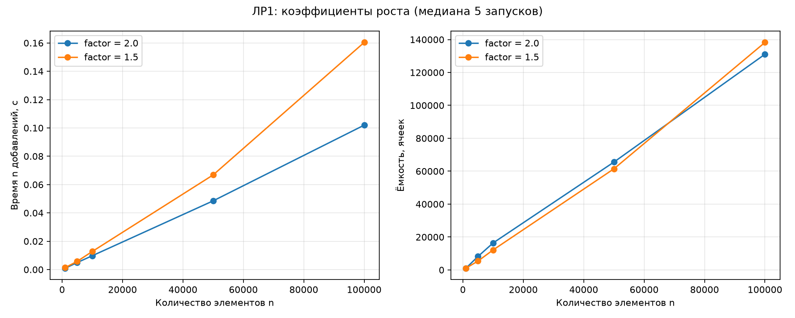
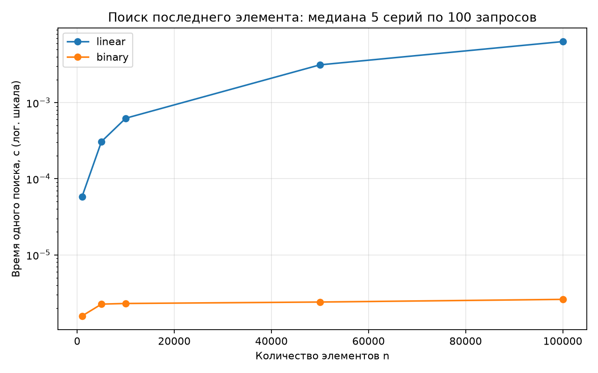

# Отчёт по лабораторной работе №1

## Цель

Реализовать массивы самостоятельно, проверить основные операции и экспериментально сравнить стратегии расширения и алгоритмы поиска.

## Реализация и проверка

Статический массив хранит ссылки на объекты в буфере `ctypes.py_object`. Динамический массив при заполнении выделяет новый буфер, копирует элементы и заменяет старый. Вставка сдвигает элементы справа налево, удаление — слева направо. Сжатие при заполнении не более четверти оставляет запас и предотвращает перевыделение при каждом чередовании добавления и удаления.

Все 6 тестовых методов прошли, включая тест из раздатки, граничные ситуации и 4500 случайных операций со сверкой с Python `list`. Демонстрационный скрипт выполнен успешно.

## Методика

Время измеряется через `time.perf_counter()`, результаты — медианы 5 независимых запусков. Каждый замер роста начинает с пустого массива; конструктор и проверка результата находятся вне измеряемого участка. Для поиска заранее подготовлен отсортированный массив, каждая серия содержит 100 запросов последнего элемента. В CSV сохранены все исходные измерения. Окружение указано в `results/environment.txt`.

## Коэффициенты роста

При 100 000 добавлений:

| Коэффициент | Медиана времени, с | Итоговая ёмкость |
|---|---:|---:|
| 2.0 | 0.101960 | 131071 |
| 1.5 | 0.160374 | 138253 |

В этом запуске коэффициент 2.0 быстрее приблизительно в 1.57 раза. Геометрический рост обеспечивает O(1) амортизированно для обоих коэффициентов; меньший коэффициент в общем случае означает больше перевыделений и копирований.

Коэффициент 1.5 не гарантирует меньшую ёмкость при каждом конкретном n: при n=100000 он только что пересёк свою границу расширения, поэтому ёмкость оказалась больше, чем у 2.0. Меньше именно относительный скачок при отдельном расширении. Для золотого уровня использована формула раздатки `int(capacity * factor) + 1`.

## Поиск

Для n=100000 медиана времени одного поиска последнего элемента: линейный — 0.006335 с, бинарный — 0.000002600 с. Линейный алгоритм проходит почти весь массив, бинарный последовательно делит диапазон пополам. Бинарный поиск требует сортировки; её стоимость в эксперимент не входит.

## Выводы

Доступ по индексу занимает O(1). Вставка и удаление в начале требуют O(n) из-за сдвига. При геометрическом расширении серия из n добавлений занимает O(n), хотя отдельное расширение стоит O(n). Бинарный поиск на отсортированных данных даёт O(log n), линейный — O(n).

Числа характеризуют конкретный запуск, зависят от оборудования и фоновой нагрузки. На графике роста показано время всей серии из n добавлений, а на графике поиска — среднее время одного запроса внутри серии. Эти величины нельзя напрямую сравнивать между собой.
